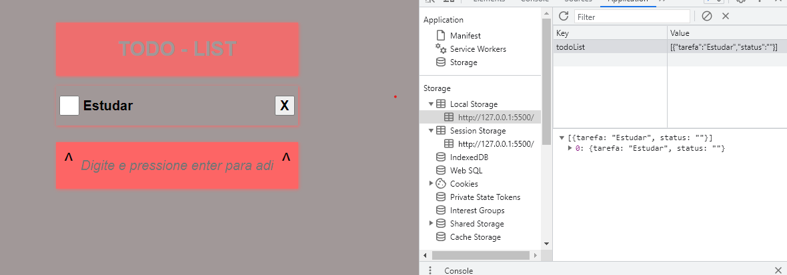
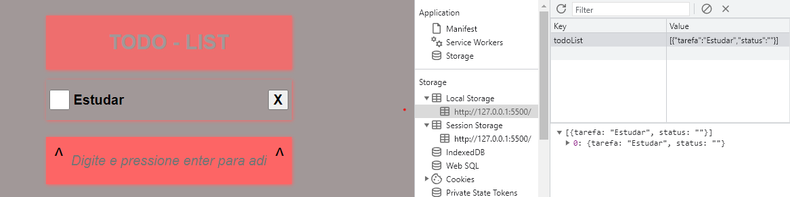
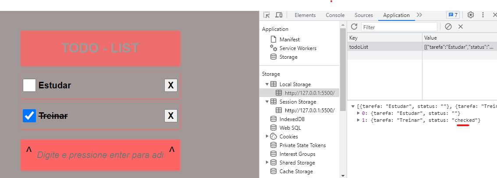

# Todo List

Este é um projeto de uma lista de tarefas simples, onde você pode adicionar, remover e marcar as tarefas como concluídas.

## Funcionalidades

- Adicionar uma nova tarefa pressionando a tecla Enter.

- Remover uma tarefa clicando no botão "X".

- Marcar uma tarefa como concluída clicando na caixa de seleção.

## Tecnologias Utilizadas

- HTML
- CSS
- JavaScript

## Detalhes do Projeto

- Utiliza o localStorage como banco de dados para armazenar as tarefas.
- As tarefas são salvas e carregadas automaticamente do localStorage.
- Evento de clique nos botões e caixas de seleção é manipulado para atualizar o estado das tarefas.
- As tarefas são renderizadas dinamicamente no HTML.

## Autor
Matheus Torquete

